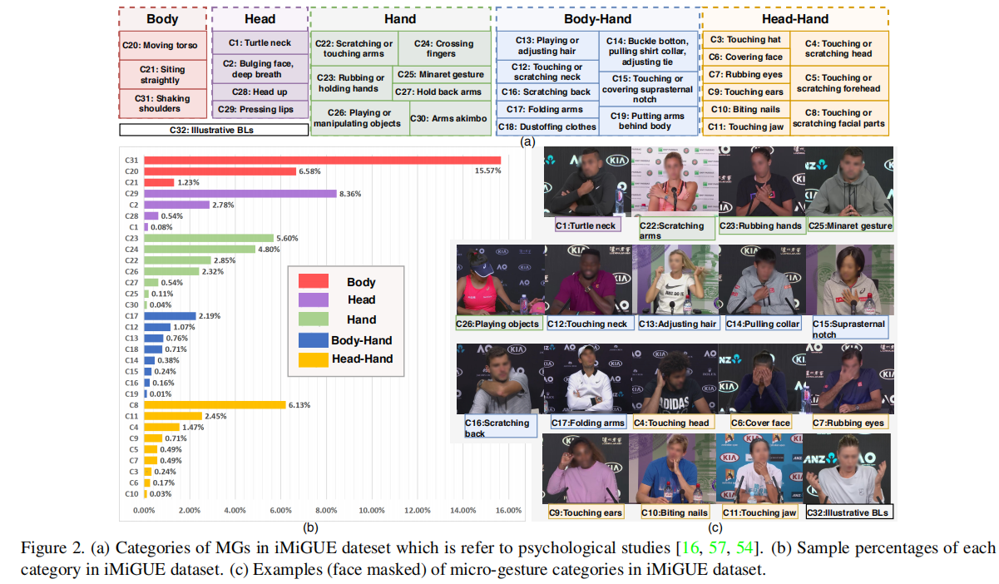

# iMiGUE

## Paper（待更新我们的链接）
### [Project Page](https://sdolivia.github.io/FineGym/) | [Videos](https://www.youtube.com/playlist?list=PL2wRKCL5yrJRBnIxWhmVr3xLJahdK5DGJ) | [Paper](https://arxiv.org/abs/2004.06704)
[iMiGUE: An Identity-free Video Dataset for Micro-Gesture Understanding and Emotion Analysis](https://sdolivia.github.io/FineGym/) <br>
 [Xin Liu](http://seea.tju.edu.cn/info/1015/2158.htm)<sup>1</sup>,
 Henglin Shi<sup>2</sup>,
 Haoyu Chen<sup>3</sup>,
 Zitong Yu<sup>4</sup>,
 Xiaobai Li<sup>5</sup>,
 Guoying Zhao<sup>6</sup> <br>
 <sup>1</sup> Center for Machine Vision and Signal Analysis, University of Oulu,Finland <br>
 <sup>2</sup> School of Electrical and Information Engineering, Tianjin University,China

<div align="center">
    
</div>

## Contents
1. [Paper](#Paper) [Information about the paper.]
2. [News!](#News!) [Check out the latest updates.]
3. [Method Zoo](#MethodZoo) [Results of different methods on iMiGUE.]
4. [Notes](#Notes) [Some details]
5. [Citation](#Citation)

## News!(待更新我们的内容)
- 08/06/2021: We release **iMiGUE dataset on github** for you to train your model! See the following for more details!
- 03/05/2020: 添加一个新消息: [FineGym Youtube Playlist](https://www.youtube.com/playlist?list=PL2wRKCL5yrJRBnIxWhmVr3xLJahdK5DGJ).
- 26/04/2020: 添加一个新消息：[FineGym Homepage](https://sdolivia.github.io/FineGym/) for more details!
- 88/03/2020: 论文发布： [FineGym: A Hierarchical Video Dataset for Fine-grained Action Understanding](https://openaccess.thecvf.com/content_CVPR_2020/html/Shao_FineGym_A_Hierarchical_Video_Dataset_for_Fine-Grained_Action_Understanding_CVPR_2020_paper.html) is accepted by CVPR 2020 as an Oral Paper, and we got Three Strong Accepts!


## MethodZoo
### Comparison of MG recognition accuracy (%) with state-of-the-art algorithms on the iMiGUE dataset.

<center>
  
| Methods | Model+Modality | acc@top1 | acc@top5 |
| :-----: | :-----: | :------: | :------: |
| SVA-E | RNN+Pose | 27.38 | 60.44 |
| LSTM | RNN+Pose | 32.36 | 72.93 |
| BLSTM | RNN+Pose | 32.39 | 71.34 |
| ST-GCN| GCN+Pose | 46.97 | 84.09 |
| 2S-GCN | GCN+Pose | 47.78 | 88.43 |
| Shift-GCN | GCN+Pose | 51.51 | 88.18 |
| GCN-NAS | GCN+Pose | 53.90 | 89.21 |
| MS-G3D | GCN+Pose | 54.91 | 89.98 |
| C3D | 3DCNN+RGB | 20.32 | 55.31 |
| R3D-101 | 3DCNN+RGB | 25.27 | 59.39 |
| I3D | 3DCNN+RGB | 34.96 | 63.69 |
| TSN | 2DCNN+RGB | 51.54 | 85.42 |
| TRN | 2DCNN+RGB | 55.24 | 89.17 |
| TSM | 2DCNN+RGB | 61.10 | 91.24 |
| P&C | Encoder-Decoder+Pose | 31.67 | 64.93 |
| U-S-VAE Z |Encoder-Decoder+Pose| 32.43 | 64.30 |

</center>

### Comparison of emotion understanding accuracy (%) with methods on iMiGUE dataset

<center>

| Methods | Model+Modality | Accuracy |
| :-----: | :-----: | :------: |
| TRN | CNN + RGB | 0.53 |
| TSM | CNN + RGB | 0.53 |
| I3D | CNN + RGB | 0.57 |
| ST-GCN| GCN+Pose | 0.50 |
| MS-G3D | GCN+Pose | 0.55 |
| U-S-VAE + LSTM | RNN + Micro-Gesture | 0.55 |
| TSM + LSTM | RNN + Micro-Gesture | 0.60 |
</center>


## Notes(待更新我们的notes)
- All feature files are in 'pickle' format, whose types are Python Dictionaries. 
- The keys of each Feature Dictionary are element id in:
	- [Gym99 Train split](https://sdolivia.github.io/FineGym/resources/dataset/gym99_train_element_v1.0.txt) or 
	- [Gymm99 Val split](https://sdolivia.github.io/FineGym/resources/dataset/gym99_val_element.txt) or 
	- [Gym288 Train split](https://sdolivia.github.io/FineGym/resources/dataset/gym288_train_element_v1.0.txt) or 
	- [Gym288 Val split](https://sdolivia.github.io/FineGym/resources/dataset/gym288_val_element.txt). 
- E.g. key: A0xAXXysHUo_E_002184_002237_A_0035_0036; The corresponding values are extracted features for that action instance. 
- The number of element-level action instances:
	- for Gym99 (v1.0) are 20484/8521 for Train/Val set respectively;
	- for Gym288 (v1.0) are 22671/9646 for Train/val set respectively.
- To keep the size of each feature file relatively small (mostly 1~2 G per file), the spatial information is pooled, resulting in spatial shape: 1 x 1.
- Details of model training and results please refer to our paper and supplementary material.
- Note that for I3D models, the extracted features are dense (i.e. seg=12, 8 frames per seg), since many element-level instances last only for 1~2 seconds.

## Citation
```
@inproceedings{Liu2021imigue,
title={iMiGUE: An Identity-free Video Dataset for Micro-Gesture Understanding and Emotion Analysis},
author={Xin Liu, Henglin Shi, Haoyu Chen, Zitong Yu, Xiaobai Li, Guoying Zhao},
booktitle={IEEE Conference on Computer Vision and Pattern Recognition (CVPR)},
year={2021}
}
